# `一、站法吐纳功` — I. Standing-Method Tu-Na Practice

## Source-faithful bilingual transcription of printed pages 32–45

`吐纳` (*tǔnà*) literally names exhalation (`吐`) and inhalation/receiving (`纳`). It is retained as **Tu-Na** because here it names the coordinated breathing practice, not a single ordinary breath.

Breath wording is translated exactly as written. In particular:

- `吸气不停` — **continue the same inhalation without interruption**;
- `呼气不停` — **continue the same exhalation without interruption**;
- `吸气至满` — **continue inhaling until full**;
- none of these phrases instructs the practitioner to hold the breath.

Terms that are compact in martial-arts Chinese are defined in the [README](README.md#compact-technical-terms). The English below does not add movement paths, breath phases, timing, or repetitions that are absent from the Chinese.

---

## Printed page 32 — `IMG_7804.HEIC`

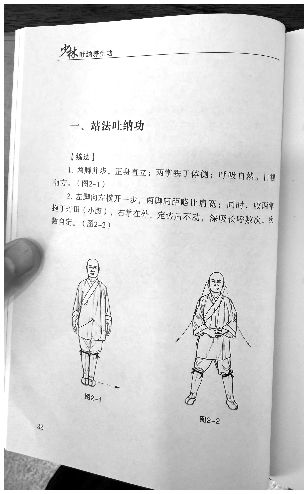

**Running header:** `少林吐纳养生功` — *Shaolin Tu-Na Health-Preservation Practice*

**Title:** `一、站法吐纳功` — *I. Standing-Method Tu-Na Practice*

**Section label:** `【练法】` — *【Method】*

### 1

**原文**

> 两脚并步，正身直立；两掌垂于体侧；呼吸自然。目视前方。（图2-1）

**English**

Bring the feet together and stand with the body aligned upright; let both open hands hang at the sides of the body; breathe naturally. Gaze forward. *(Figure 2-1.)*

### 2

**原文**

> 左脚向左横开一步，两脚间距略比肩宽；同时，收两掌抱于丹田（小腹），右掌在外。定势后不动，深吸长呼数次，次数自定。（图2-2）

**English**

Step the left foot one step horizontally to the left, leaving the feet slightly more than shoulder-width apart; at the same time, draw in both open hands and hold them at the *dantian* (lower abdomen), with the right palm on the outside. After the posture has been set, remain still. Perform several deep inhalations and prolonged exhalations; determine the number yourself. *(Figure 2-2.)*

**Visible figure labels:** `图2-1`, `图2-2` — *Figures 2-1 and 2-2*

---

## Printed page 33 — `IMG_7805.HEIC`

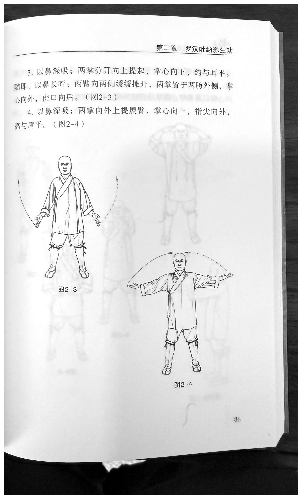

**Running header:** `第二章 罗汉吐纳养生功` — *Chapter 2: Luohan (Arhat) Tu-Na Health-Preservation Practice*

### 3

**原文**

> 以鼻深吸；两掌分开向上提起，掌心向下，约与耳平。随即，以鼻长呼；两臂向两侧缓缓摊开，两掌置于两胯外侧，掌心向外，虎口向后。（图2-3）

**English**

Inhale deeply through the nose; separate the two open hands and lift them upward, palms facing down, to approximately ear level. Immediately afterward, make a prolonged exhalation through the nose; slowly spread both arms open toward the sides and place the hands outside the hips, palms facing outward and the tiger's mouths—the thumb–index webs—directed backward. *(Figure 2-3.)*

### 4

**原文**

> 以鼻深吸；两掌向外上提展臂，掌心向上，指尖向外，高与肩平。（图2-4）

**English**

Inhale deeply through the nose; lift both open hands outward and upward while extending the arms, palms facing up and fingertips pointing outward, at shoulder height. *(Figure 2-4.)*

**Visible figure labels:** `图2-3`, `图2-4` — *Figures 2-3 and 2-4*

---

## Printed page 34 — `IMG_7806.heic`

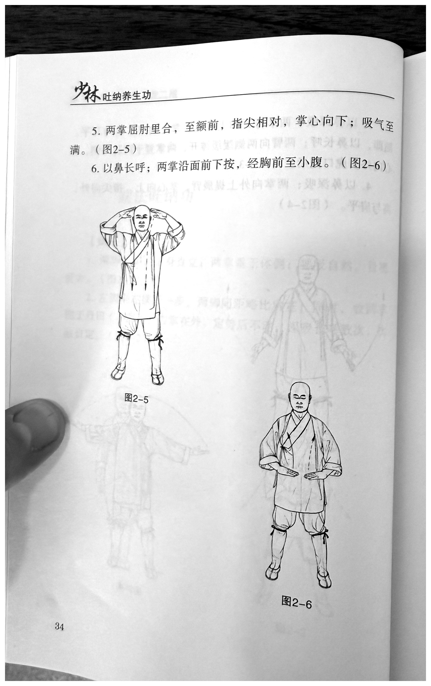

**Running header:** `少林吐纳养生功` — *Shaolin Tu-Na Health-Preservation Practice*

### 5

**原文**

> 两掌屈肘里合，至额前，指尖相对，掌心向下；吸气至满。（图2-5）

**English**

Bend the elbows and bring the two open hands inward toward one another in front of the forehead, fingertips facing each other and palms facing down; continue inhaling until full. *(Figure 2-5.)*

### 6

**原文**

> 以鼻长呼；两掌沿面前下按，经胸前至小腹。（图2-6）

**English**

Make a prolonged exhalation through the nose; press both open hands downward along the front of the face, passing in front of the chest and continuing to the lower abdomen. *(Figure 2-6.)*

**Visible figure labels:** `图2-5`, `图2-6` — *Figures 2-5 and 2-6*

---

## Printed page 35 — `IMG_7807.HEIC`

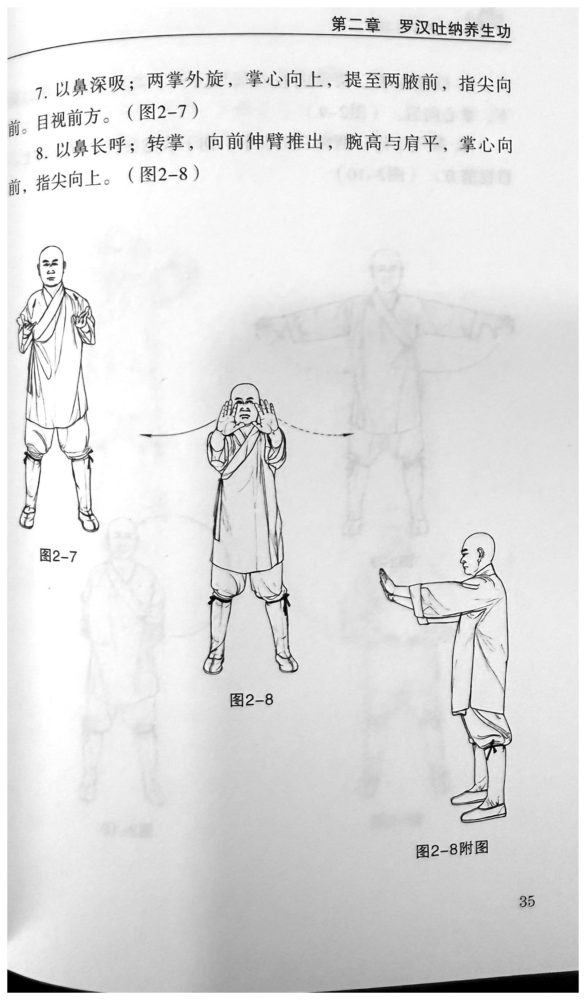

**Running header:** `第二章 罗汉吐纳养生功` — *Chapter 2: Luohan (Arhat) Tu-Na Health-Preservation Practice*

### 7

**原文**

> 以鼻深吸；两掌外旋，掌心向上，提至两腋前，指尖向前。目视前方。（图2-7）

**English**

Inhale deeply through the nose; externally rotate both open hands so the palms face up, then lift them in front of the armpits, fingertips pointing forward. Gaze forward. *(Figure 2-7.)*

### 8

**原文**

> 以鼻长呼；转掌，向前伸臂推出，腕高与肩平，掌心向前，指尖向上。（图2-8）

**English**

Make a prolonged exhalation through the nose; turn the hands, extend the arms forward, and push out. Keep the wrists at shoulder height, with the palms facing forward and the fingertips pointing upward. *(Figure 2-8.)*

**Visible figure labels:** `图2-7`, `图2-8`, `图2-8附图` — *Figures 2-7 and 2-8; supplementary view for Figure 2-8*

---

## Printed page 36 — `IMG_7808.HEIC`

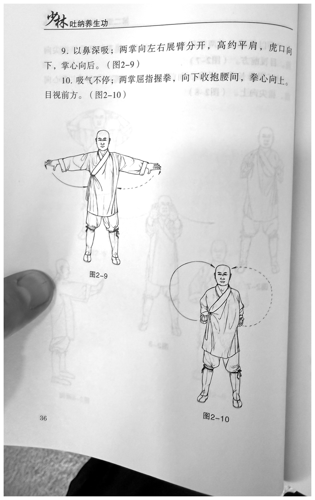

**Running header:** `少林吐纳养生功` — *Shaolin Tu-Na Health-Preservation Practice*

### 9

**原文**

> 以鼻深吸；两掌向左右展臂分开，高约平肩，虎口向下，掌心向后。（图2-9）

**English**

Inhale deeply through the nose; open the arms and separate the two open hands to the left and right at approximately shoulder height, with the tiger's mouths directed downward and the palms facing backward. *(Figure 2-9.)*

### 10

**原文**

> 吸气不停；两掌屈指握拳，向下收抱腰间，拳心向上。目视前方。（图2-10）

**English**

Continue the same inhalation without interruption; curl the fingers of both hands to form fists and draw them downward to the waist, with the palm sides of the fists facing up. Gaze forward. *(Figure 2-10.)*

**Visible figure labels:** `图2-9`, `图2-10` — *Figures 2-9 and 2-10*

---

## Printed page 37 — `IMG_7809.HEIC`

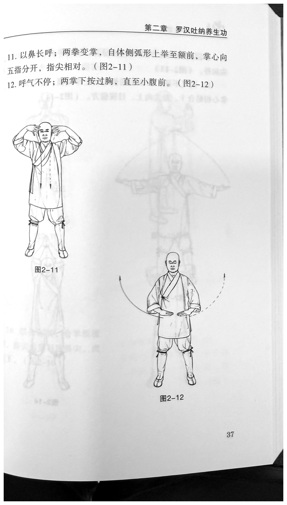

**Running header:** `第二章 罗汉吐纳养生功` — *Chapter 2: Luohan (Arhat) Tu-Na Health-Preservation Practice*

### 11

**原文**

> 以鼻长呼；两拳变掌，自体侧弧形上举至额前，掌心向下，五指分开，指尖相对。（图2-11）

**English**

Make a prolonged exhalation through the nose; open both fists into open hands and raise them in arcs from the sides of the body to the front of the forehead, palms facing down, all five fingers spread, and fingertips facing one another. *(Figure 2-11.)*

### 12

**原文**

> 呼气不停；两掌下按过胸，直至小腹前。（图2-12）

**English**

Continue the same exhalation without interruption; press both open hands downward past the chest until they are in front of the lower abdomen. *(Figure 2-12.)*

**Visible figure labels:** `图2-11`, `图2-12` — *Figures 2-11 and 2-12*

---

## Printed page 38 — `IMG_7810.HEIC`

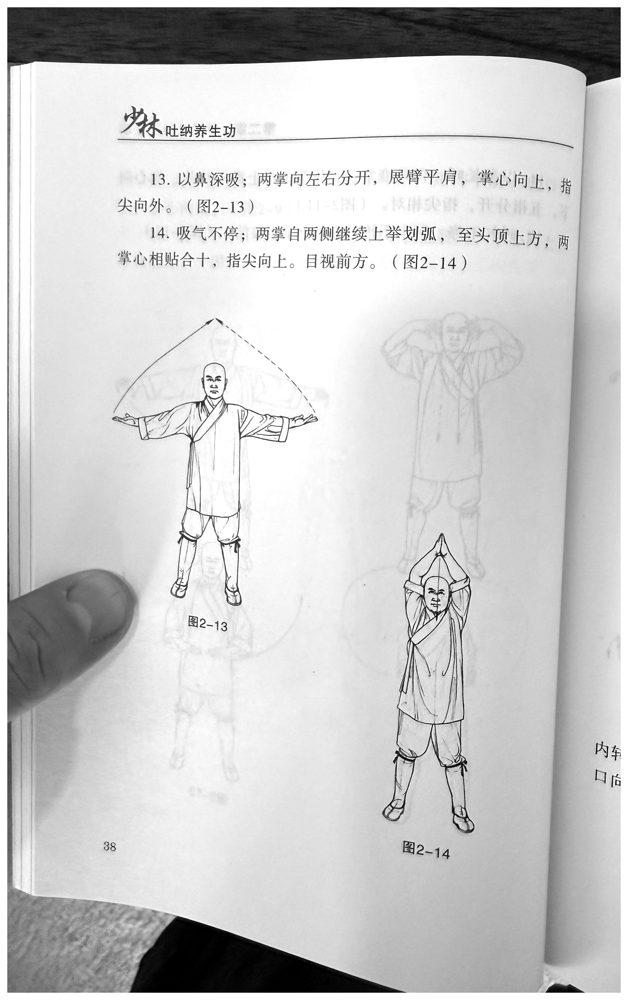

**Running header:** `少林吐纳养生功` — *Shaolin Tu-Na Health-Preservation Practice*

### 13

**原文**

> 以鼻深吸；两掌向左右分开，展臂平肩，掌心向上，指尖向外。（图2-13）

**English**

Inhale deeply through the nose; separate the two open hands to the left and right and extend the arms at shoulder height, palms facing up and fingertips pointing outward. *(Figure 2-13.)*

### 14

**原文**

> 吸气不停；两掌自两侧继续上举划弧，至头顶上方，两掌心相贴合十，指尖向上。目视前方。（图2-14）

**English**

Continue the same inhalation without interruption; continue raising both open hands from the sides in arcs until they are above the head. Place the two palms together in *heshi*, fingertips pointing upward. Gaze forward. *(Figure 2-14.)*

**Visible figure labels:** `图2-13`, `图2-14` — *Figures 2-13 and 2-14*

---

## Printed page 39 — `IMG_7811.HEIC`

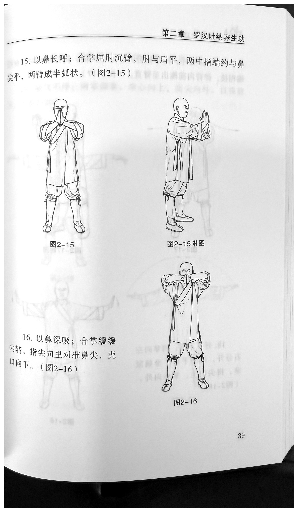

**Running header:** `第二章 罗汉吐纳养生功` — *Chapter 2: Luohan (Arhat) Tu-Na Health-Preservation Practice*

### 15

**原文**

> 以鼻长呼；合掌屈肘沉臂，肘与肩平，两中指端约与鼻尖平，两臂成半弧状。（图2-15）

**English**

Make a prolonged exhalation through the nose; keeping the palms joined, bend the elbows and sink the arms. Keep the elbows level with the shoulders; the tips of both middle fingers are approximately level with the tip of the nose, and the two arms form a half-arc. *(Figure 2-15.)*

### 16

**原文**

> 以鼻深吸；合掌缓缓内转，指尖向里对准鼻尖，虎口向下。（图2-16）

**English**

Inhale deeply through the nose; slowly rotate the joined palms inward so the fingertips point inward and align with the tip of the nose, with the tiger's mouths directed downward. *(Figure 2-16.)*

**Visible figure labels:** `图2-15`, `图2-15附图`, `图2-16` — *Figure 2-15, its supplementary view, and Figure 2-16*

---

## Printed page 40 — `IMG_7812.heic`

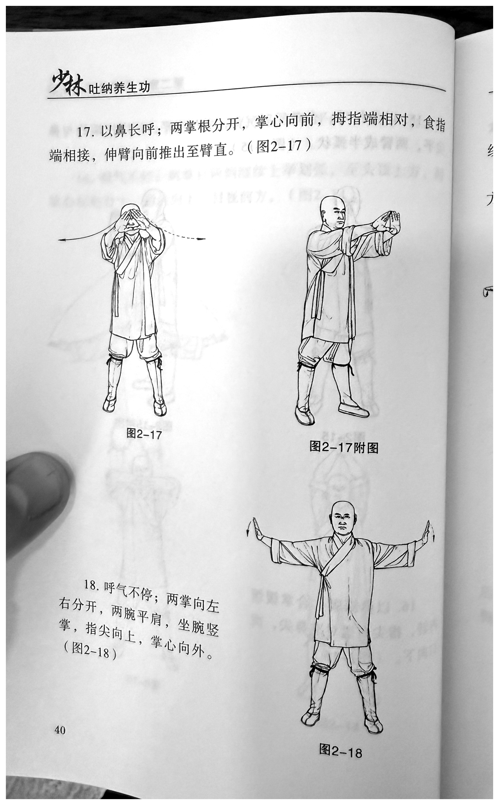

**Running header:** `少林吐纳养生功` — *Shaolin Tu-Na Health-Preservation Practice*

### 17

**原文**

> 以鼻长呼；两掌根分开，掌心向前，拇指端相对，食指端相接，伸臂向前推出至臂直。（图2-17）

**English**

Make a prolonged exhalation through the nose; separate the heels of the two palms, with the palms facing forward, the thumb tips facing one another, and the index-finger tips meeting. Extend the arms and push forward until the arms are straight. *(Figure 2-17.)*

### 18

**原文**

> 呼气不停；两掌向左右分开，两腕平肩，坐腕竖掌，指尖向上，掌心向外。（图2-18）

**English**

Continue the same exhalation without interruption; separate the two open hands to the left and right, with both wrists at shoulder height. Set the wrists in extension (*zuòwàn*) so the palms stand vertical, fingertips pointing upward and palms facing outward. *(Figure 2-18.)*

**Visible figure labels:** `图2-17`, `图2-17附图`, `图2-18` — *Figure 2-17, its supplementary view, and Figure 2-18*

---

## Printed page 41 — `IMG_7813.heic`

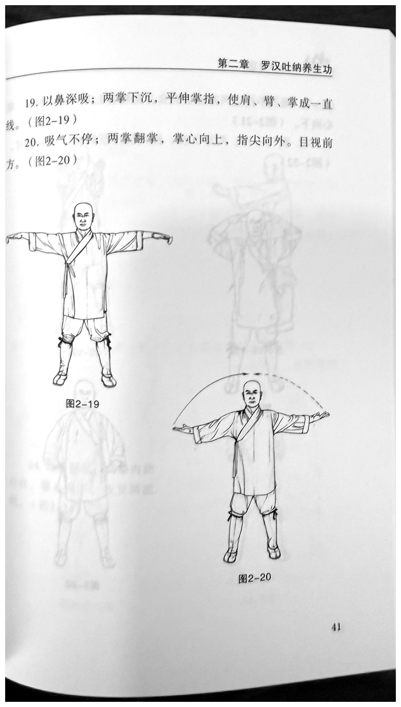

**Running header:** `第二章 罗汉吐纳养生功` — *Chapter 2: Luohan (Arhat) Tu-Na Health-Preservation Practice*

### 19

**原文**

> 以鼻深吸；两掌下沉，平伸掌指，使肩、臂、掌成一直线。（图2-19）

**English**

Inhale deeply through the nose; sink both open hands and extend the palms and fingers horizontally, so that the shoulders, arms, and hands form one straight line. *(Figure 2-19.)*

### 20

**原文**

> 吸气不停；两掌翻掌，掌心向上，指尖向外。目视前方。（图2-20）

**English**

Continue the same inhalation without interruption; turn both open hands over so the palms face up and the fingertips point outward. Gaze forward. *(Figure 2-20.)*

**Visible figure labels:** `图2-19`, `图2-20` — *Figures 2-19 and 2-20*

---

## Printed page 42 — `IMG_7814.HEIC`

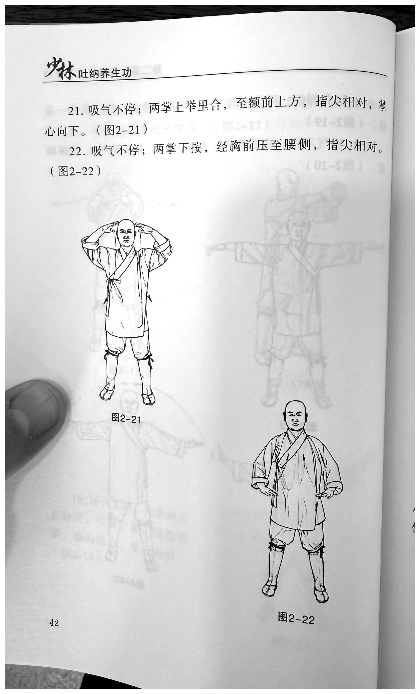

**Running header:** `少林吐纳养生功` — *Shaolin Tu-Na Health-Preservation Practice*

### 21

**原文**

> 吸气不停；两掌上举里合，至额前上方，指尖相对，掌心向下。（图2-21）

**English**

Continue the same inhalation without interruption; raise both open hands and bring them inward toward one another to a position above and in front of the forehead, fingertips facing each other and palms facing down. *(Figure 2-21.)*

### 22

**原文**

> 吸气不停；两掌下按，经胸前压至腰侧，指尖相对。（图2-22）

**English**

Continue the same inhalation without interruption; press both open hands downward, passing in front of the chest and continuing to the sides of the waist, with the fingertips facing one another. *(Figure 2-22.)*

**Visible figure labels:** `图2-21`, `图2-22` — *Figures 2-21 and 2-22*

> **Source-record note:** `IMG_7815.HEIC` is a second photograph of the same printed page. The print edition uses the cleaner complete-page record, `IMG_7814.HEIC`; the text is identical.

---

## Printed page 43 — `IMG_7816.heic`

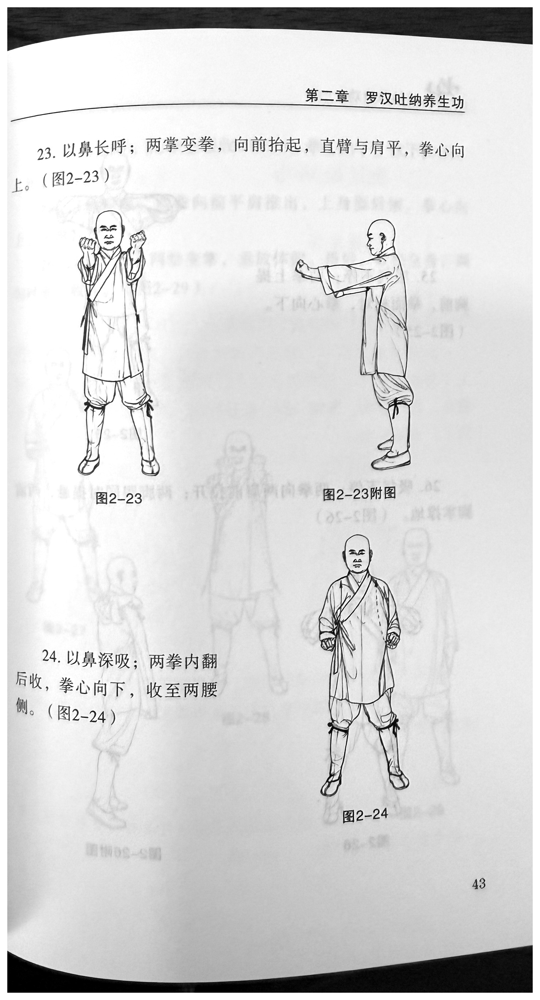

**Running header:** `第二章 罗汉吐纳养生功` — *Chapter 2: Luohan (Arhat) Tu-Na Health-Preservation Practice*

### 23

**原文**

> 以鼻长呼；两掌变拳，向前抬起，直臂与肩平，拳心向上。（图2-23）

**English**

Make a prolonged exhalation through the nose; close both open hands into fists and raise them forward, keeping the straight arms level with the shoulders and the palm sides of the fists facing up. *(Figure 2-23.)*

### 24

**原文**

> 以鼻深吸；两拳内翻后收，拳心向下，收至两腰侧。（图2-24）

**English**

Inhale deeply through the nose; turn both fists inward and then draw them back, with the palm sides of the fists facing down, until they reach the two sides of the waist. *(Figure 2-24.)*

**Visible figure labels:** `图2-23`, `图2-23附图`, `图2-24` — *Figure 2-23, its supplementary view, and Figure 2-24*

---

## Printed page 44 — `IMG_7817.HEIC`

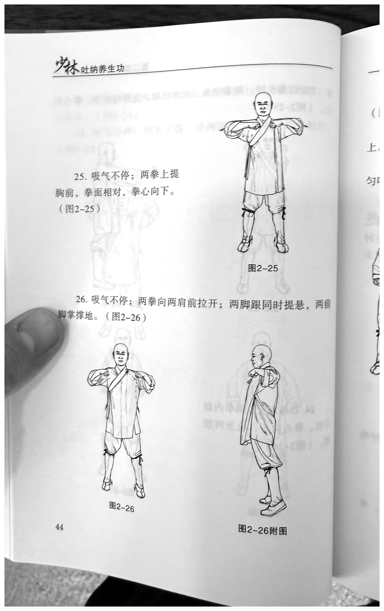

**Running header:** `少林吐纳养生功` — *Shaolin Tu-Na Health-Preservation Practice*

### 25

**原文**

> 吸气不停；两拳上提胸前，拳面相对，拳心向下。（图2-25）

**English**

Continue the same inhalation without interruption; lift both fists in front of the chest, with the fist faces—the knuckle surfaces—facing one another and the palm sides of the fists facing down. *(Figure 2-25.)*

### 26

**原文**

> 吸气不停；两拳向两肩前拉开；两脚跟同时提悬，两前脚掌撑地。（图2-26）

**English**

Continue the same inhalation without interruption; pull the two fists apart to positions in front of the shoulders. At the same time, raise both heels clear of the ground and support the body through the forefeet—the balls of the feet. *(Figure 2-26.)*

**Visible figure labels:** `图2-25`, `图2-26`, `图2-26附图` — *Figures 2-25 and 2-26; supplementary view for Figure 2-26*

---

## Printed page 45 — `IMG_7818.heic`

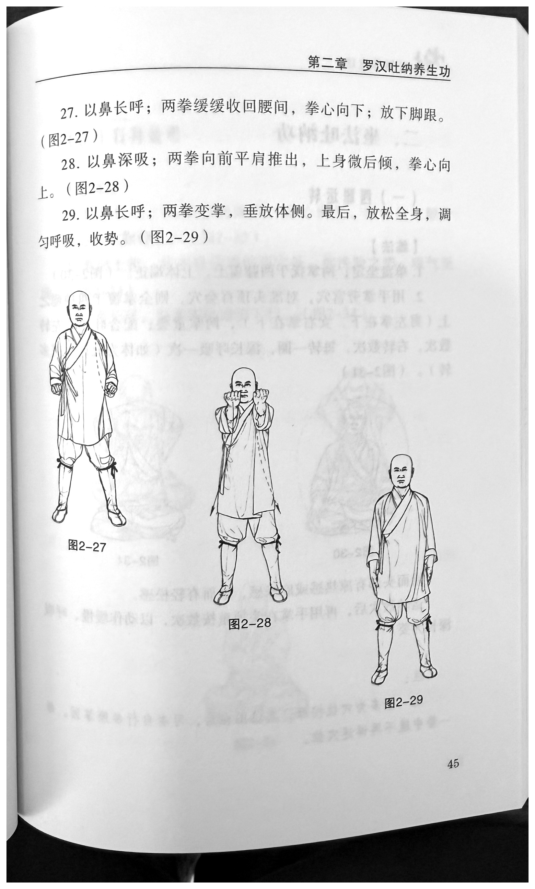

**Running header:** `第二章 罗汉吐纳养生功` — *Chapter 2: Luohan (Arhat) Tu-Na Health-Preservation Practice*

### 27

**原文**

> 以鼻长呼；两拳缓缓收回腰间，拳心向下；放下脚跟。（图2-27）

**English**

Make a prolonged exhalation through the nose; slowly draw both fists back to the waist, with the palm sides of the fists facing down; lower the heels. *(Figure 2-27.)*

### 28

**原文**

> 以鼻深吸；两拳向前平肩推出，上身微后倾，拳心向上。（图2-28）

**English**

Inhale deeply through the nose; push both fists forward at shoulder height, inclining the upper body slightly backward, with the palm sides of the fists facing up. *(Figure 2-28.)*

### 29

**原文**

> 以鼻长呼；两拳变掌，垂放体侧。最后，放松全身，调匀呼吸，收势。（图2-29）

**English**

Make a prolonged exhalation through the nose; open both fists into open hands and lower them to hang at the sides of the body. Finally, relax the whole body, regulate the breathing until it is even, and close the form. *(Figure 2-29.)*

**Visible figure labels:** `图2-27`, `图2-28`, `图2-29` — *Figures 2-27, 2-28, and 2-29*
